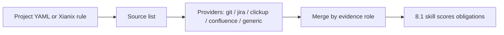
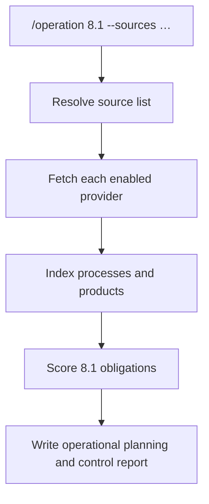

**Operation** automates ISO 9001:2015 **Clause 8 Operation**. Each control is a separate skill so they can be added independently.

Evidence does **not** come from git alone. Each Xianix project declares its own sources (Jira, ClickUp, Confluence/wiki, git, generic URLs). The plugin supplies adapters; the project (or the rule) supplies which systems to use.

Current coverage:

| Control | Skill | Status |
|---|---|---|
| **8.1** Operational planning and control | `8-1-operational-planning-and-control` | Available |
| 8.2 Requirements for products and services | — | Planned |
| 8.3 Design and development | — | Planned |
| 8.4 Control of externally provided processes, products and services | — | Planned |
| 8.5 Production and service provision | — | Planned |
| 8.6 Release of products and services | — | Planned |
| 8.7 Control of nonconforming outputs | — | Planned |

---

## How sources work



| Layer | Lives in | Example |
|---|---|---|
| **Roles** (what 8.1 needs) | this plugin | `documented-information`, `process-control` |
| **Providers** (how to fetch) | `providers/` | Confluence CQL, Jira JQL |
| **Sources** (which systems *this* project uses) | `.xianix/operation-sources.yaml` or rule `sources-config` | space `QUALITY`, JQL `project = APP` |
| **Secrets** | rule `with-envs` | `ATLASSIAN-API-TOKEN` |

Details: [docs/sources.md](docs/sources.md) · contract: [providers/_source-contract.md](providers/_source-contract.md) · webhook rules: [docs/rules-examples.md](docs/rules-examples.md) · scheduled rule file: [docs/rules-schedule.json](docs/rules-schedule.json) ([docs/rules-schedule.md](docs/rules-schedule.md)).

Copy [docs/operation-sources.example.yaml](docs/operation-sources.example.yaml) into the consuming repo as `.xianix/operation-sources.yaml`.

---

## How 8.1 works



1. **Resolve sources** — project YAML, rule input, or implicit `git-repo`.
2. **Fetch** — only declared systems; missing optional tokens mark that source unavailable.
3. **Assess 8.1** — Conform / Partial / Gap / N/A with locators (wiki, issue, path).
4. **Write the report** — `iso-9001-8.1-operational-planning-and-control.md`.

This is an **assessment and planning** run. It does not rewrite product code.

---

## Inputs

| Input | Required | Description |
|---|---|---|
| Control | No | Defaults to `8.1`. |
| `--sources <path>` | No | Source YAML. Default search: `.xianix/operation-sources.yaml`. |
| `--scope <path>` | No | Limits **git-repo** only. Does not ignore Jira/Confluence/ClickUp. |

---

## Sample prompts

```text
/operation 8.1
/operation 8.1 --sources .xianix/operation-sources.yaml
/operation 8.1 --sources .xianix/operation-sources.yaml --scope src
```

---

## Output

`iso-9001-8.1-operational-planning-and-control.md` at the repository root, including a **Sources used** table and the 8.1 obligation scores, plus its machine-readable twin `compliance-report.json` ([contract](../../contracts/README.md)).

The bundled publisher (`scripts/publish-aihub.mjs`) validates `compliance-report.json`, writes `aihub-event.json`, and — when `AIHUB_PUBLISH=1` — uploads each control's detailed report to 99x AI Hub as a write-once artifact, then sends one **summary** event per control assessed, linking to that artifact by id and SHA-256. Nothing is written to the audited repository unless `COMPLIANCE_DETAIL_STORE=github` asks for it, and then only by the publisher through the GitHub API: the plugin's hook blocks the agent itself from committing, pushing, opening pull requests or commenting. The summary has a GitHub issue-comment fallback. Dashboards read verdicts, gap lines, actions and source status from the summary; evidence and the full report are in the artifact. Setup: [docs/rules-examples.md](docs/rules-examples.md#publish-results-to-ai-hub-pilot).

---

## What's in this plugin

```
operation/
├── .claude-plugin/plugin.json
├── commands/operation.md
├── skills/8-1-operational-planning-and-control/SKILL.md
├── providers/
│   ├── _source-contract.md
│   ├── git-repo.md
│   ├── jira.md
│   ├── clickup.md
│   ├── confluence.md
│   └── generic.md
├── scripts/publish-aihub.mjs   # generated from tools/ — do not edit
├── hooks/
│   ├── hooks.json
│   └── validate-prerequisites.sh   # keeps the audit read-only and the AI Hub key out of the logs
├── styles/
│   ├── report-template.md
│   └── report-json.md
├── docs/
│   ├── sources.md
│   ├── rules-examples.md
│   ├── rules-schedule.json
│   ├── rules-schedule.md
│   └── operation-sources.example.yaml
└── README.md
```

Add a control: new `skills/<clause>-<slug>/SKILL.md` (reuse the same sources). Add a vendor: new `providers/<name>.md` (no skill change).

Before a release, `claude plugin validate plugins/operation` should pass (its only warning, about the `providers` field, is shared by every Xianix plugin). `npm test` in `tools/` parses every command and skill header strictly, as Claude Code does: a header that fails to parse loads with no name or description.

### The hook

`hooks/validate-prerequisites.sh` runs before every shell command the agent runs. It refuses:

| What | Why |
|---|---|
| `git commit`, `push`, `merge`, `rebase`, `tag`, `reset --hard`, a new branch | The audited repository is usually the customer's; an audit only reads |
| `gh pr` / `gh issue` create, comment, edit, close, merge; `gh api` writes | Results go to AI Hub, not to the repository |
| Any command naming `AIHUB_API_KEY` | The publisher reads the key itself; it must not reach the logs (F4) |
| Running the publisher without Node.js | Says why delivery cannot happen, instead of failing later |

---

## License

MIT
