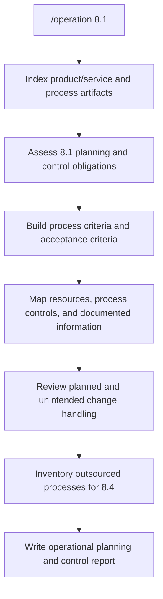

**Operation** automates ISO 9001:2015 **Clause 8 Operation**. Each control is a separate skill so they can be added independently.

Current coverage:

| Control | Skill | Status |
|---|---|---|
| **8.1** Operational planning and control | `8-1-operational-planning-and-control` | Available |
| 8.2 Requirements for products and services | — | Planned |
| 8.3 Design and development | — | Planned |
| 8.4 Control of externally provided processes, products and services | — | Planned |
| 8.5 Production and service provision | — | Planned |
| 8.6 Release of products and services | — | Planned |
| 8.7 Control of nonconforming outputs | — | Planned |

---

## How it works



1. **Discover** — index the repository for products/services, process definitions, QMS records, pipelines, tests, change history, and supplier/outsourcing signals.
2. **Assess 8.1** — score each planning and control obligation as Conform / Partial / Gap / Not applicable, with file evidence.
3. **Produce planning outputs** — process criteria, acceptance criteria, resource needs, control map, and documented-information inventory.
4. **Write the report** — `iso-9001-8.1-operational-planning-and-control.md` using `styles/report-template.md`.

This is an **assessment and planning** run. It does not rewrite product code. It writes the report (and, when gaps are clear, recommended documented-information stubs under `compliance/iso-9001/8.1/` if that directory already exists or the user asked for artifacts).

---

## Inputs

| Input | Required | Description |
|---|---|---|
| Control | No | Defaults to `8.1`. Later skills will accept `8.2`–`8.7`. |
| `--scope <path>` | No | Limit discovery to a directory or glob (for example `docs/qms`, `processes`). |

---

## Sample prompts

```text
/operation
/operation 8.1
/operation 8.1 --scope docs/qms
```

Or ask the agent to run operational planning and control / ISO 9001 8.1 against the current repository.

---

## Output

Every 8.1 run writes **one report** at the repository root:

`iso-9001-8.1-operational-planning-and-control.md`

The report includes:

- Product/service requirement determination
- Process criteria and acceptance criteria
- Resources needed for conformity
- Process control against those criteria
- Documented information to show processes ran as planned and outputs conform
- Suitability of planning outputs for operations
- Planned-change control and review of unintended changes
- Outsourced-process inventory (handoff to 8.4; that control is not assessed here)

---

## What's in this plugin

```
operation/
├── .claude-plugin/
│   └── plugin.json
├── commands/
│   └── operation.md
├── skills/
│   └── 8-1-operational-planning-and-control/SKILL.md
├── styles/
│   └── report-template.md
└── README.md
```

Add a new control by creating `skills/<clause>-<slug>/SKILL.md` and routing it from `commands/operation.md`. Do not fold later controls into the 8.1 skill.

---

## License

MIT
